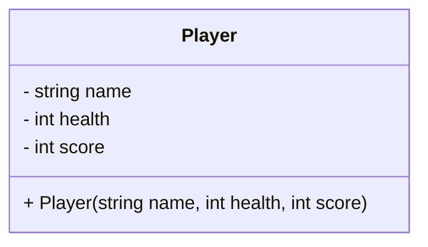
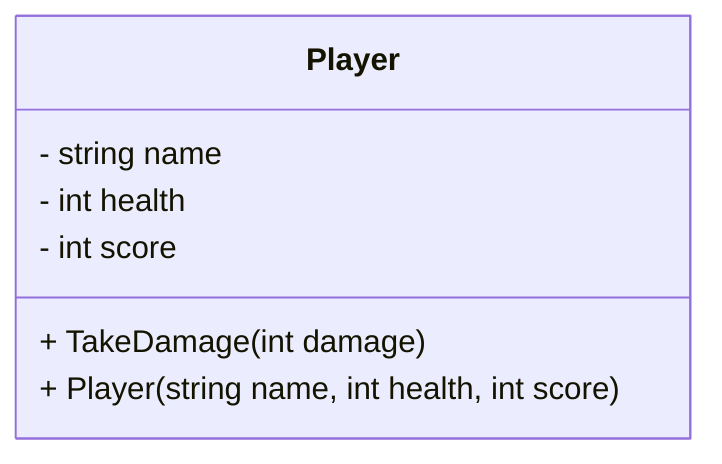
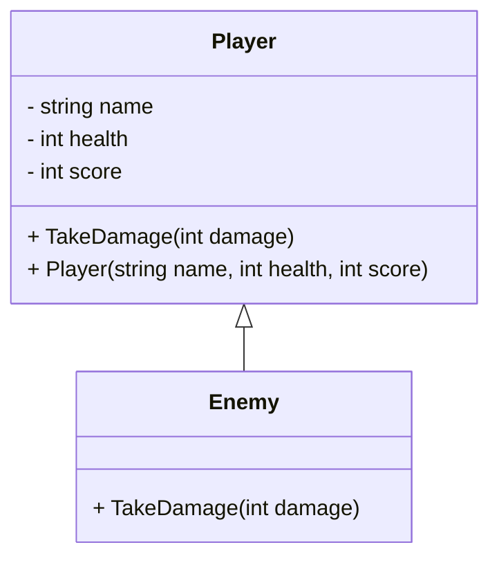
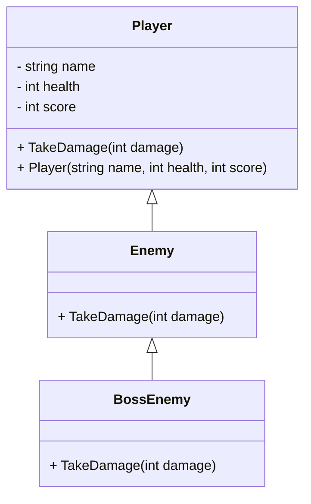
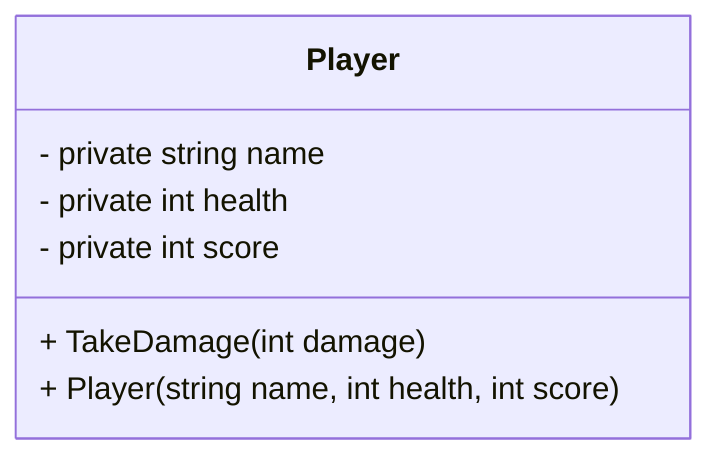
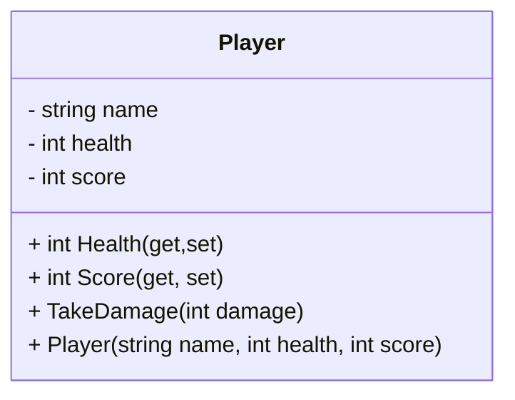
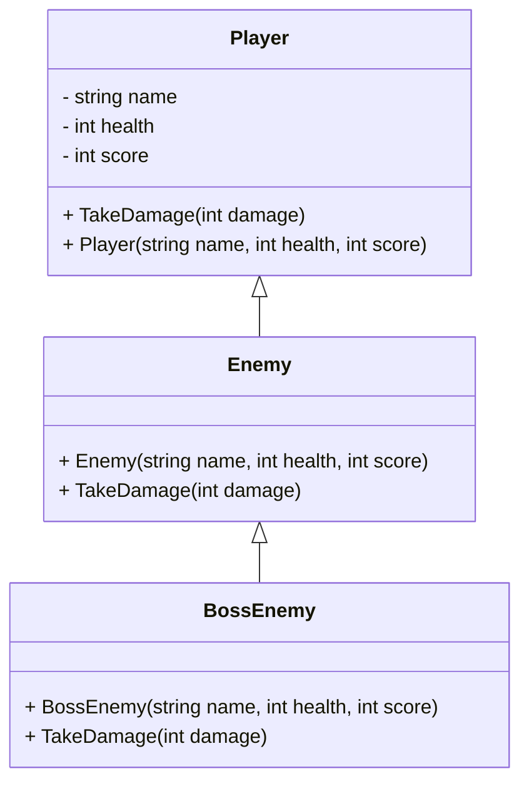

## Exercises - Class Definition & Inheritance

### Exercise 1: Creating a Simple Class
**Description**: Create a class called `Player` with fields for `name` (string), `health` (int), and `score` (int). In the `Start()` method of a script, create an instance of `Player`, set its values, and print them using `System.Debug.WriteLn`.  
**Difficulty**: Easy

---

### Exercise 2: Class Methods
**Description**: Expand the `Player` class by adding a method `TakeDamage(int damage)` that decreases the `health` of the player by the amount of damage taken. Test the method by calling it in the `Start()` method and printing the player’s new health.  
**Difficulty**: Easy

---

### Exercise 3: Constructors
**Description**: Modify the `Player` class by adding a constructor that takes `name`, `health`, and `score` as parameters to initialize the fields. Create an instance of `Player` using this constructor in the `Start()` method.  
**Difficulty**: Easy

---

### Exercise 4: Inheritance & Overriding
**Description**: Create a class `Enemy` that inherits from the `Player` class. Override the `TakeDamage()` method in `Enemy` to make the enemy lose double the damage amount. Create an instance of `Enemy` in `Start()` and test the method.  
**Difficulty**: Medium

---

### Exercise 5: Polymorphism
**Description**: Create another class `BossEnemy` that inherits from `Enemy`. Implement polymorphism by overriding the `TakeDamage()` method in `BossEnemy` to lose only half the damage. Create instances of `Enemy` and `BossEnemy`, and test them to see how damage is handled differently.  
**Difficulty**: Medium

---

### Exercise 6: Access Modifiers
**Description**: Modify the `Player` class to use appropriate access modifiers (`private`, `protected`, `public`) for fields and methods. Test the access restrictions by trying to directly access `health` from outside the class.  
**Difficulty**: Medium

---

### Exercise 7: Properties (Getters & Setters)
**Description**: Refactor the `Player` class to use C# properties (`get` and `set`) for `health` and `score`. Add validation in the setter of `health` to ensure it cannot go below zero. Test the property by trying to set `health` to a negative value.  
**Difficulty**: Medium

---

### Exercise 8: Inheritance with Constructor Chaining
**Description**: Modify the `Enemy` and `BossEnemy` classes to use constructor chaining when initializing `Player`'s fields (e.g., passing values to the base `Player` constructor). Create instances of both `Enemy` and `BossEnemy` with specific health values and verify that the constructor chain works properly.  
**Difficulty**: Medium

