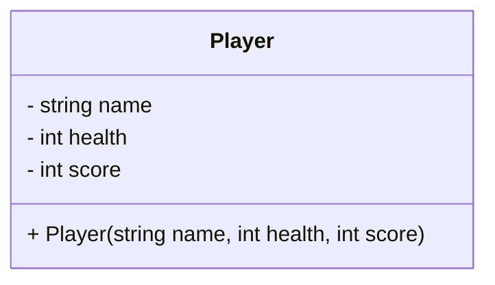
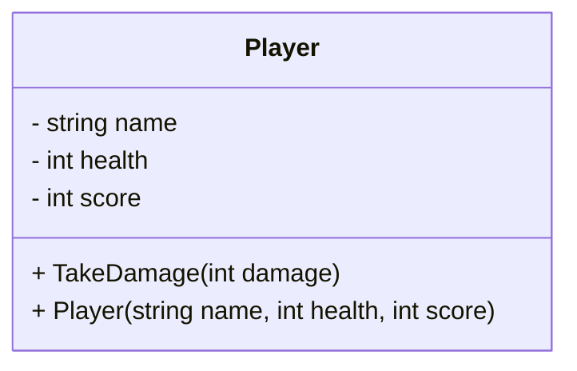
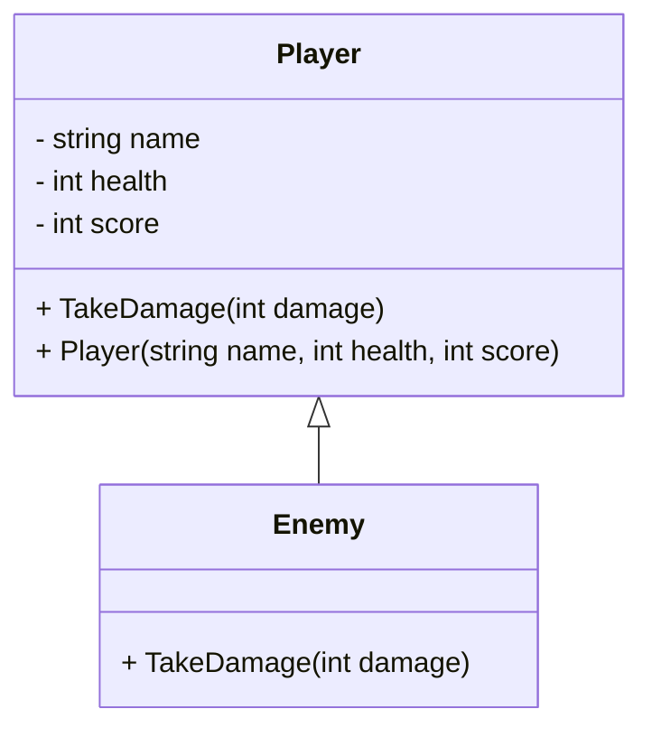
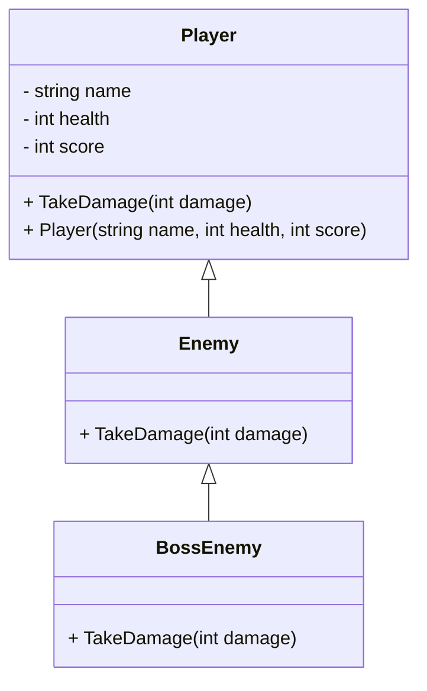
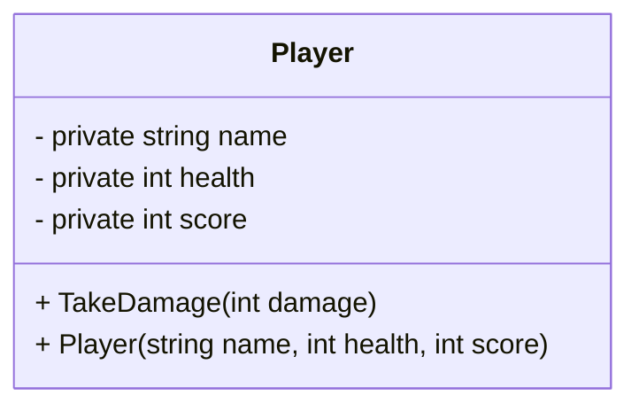
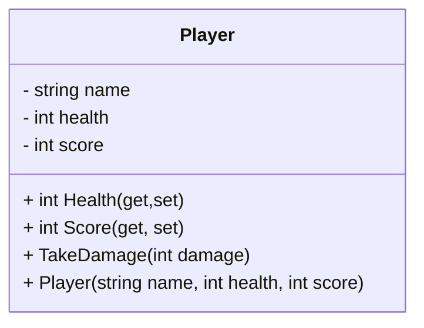
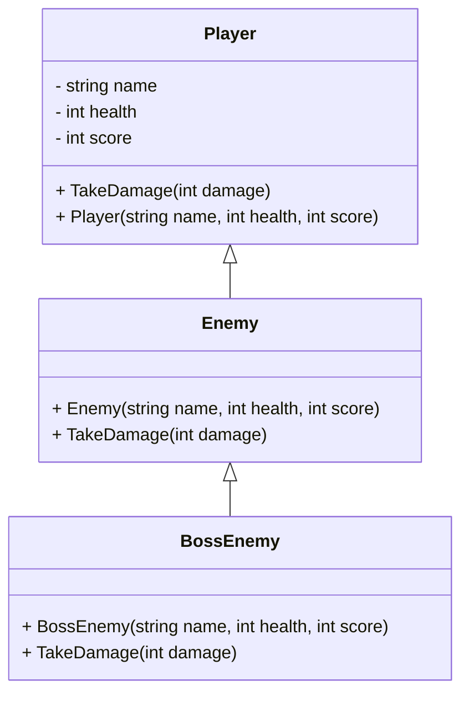

# 2024 - 25 - GD - C# Concepts for Game Developers 

## Overview 
This repository contains code samples used to learn the basics of C# in preparation for the development of the code for this module.

## Useful 
- [Markdown](https://docs.github.com/en/enterprise-cloud@latest/get-started/writing-on-github/getting-started-with-writing-and-formatting-on-github/basic-writing-and-formatting-syntax) in GitHub
- Add emojis with [gitmoji](https://gitmoji.dev/) to your Git commits to improve readability

## Required Reading 
- [Tutorials Teacher - Learn C#](https://www.tutorialsteacher.com/csharp)
- [Refactoring Guru - Design Patterns](https://refactoring.guru/design-patterns) 


## Contents - General 

| Completed | Topic | Description | Recommended Reading |
| :-------: | :---------------- | :--------------- | :--------------- | 
| [ ] | **Namespace Definition** | Organizing game code using namespaces to prevent conflicts. | [Namespace](https://www.tutorialspoint.com/csharp/csharp_namespaces.htm) |
| [ ] | **Value and Reference Types** | Managing memory in Unity by understanding value and reference types. | [Value type and Reference type](https://www.tutorialsteacher.com/csharp/csharp-value-type-and-reference-type) |
| [ ] | **Keywords (ref, out)** | Use of `ref` and `out` in game functions to optimize performance. | [ref](https://www.geeksforgeeks.org/ref-in-c-sharp/), [out](https://www.geeksforgeeks.org/out-parameter-with-examples-in-c-sharp/) |
| [ ] | **Class Definition & Inheritance** | Class structures, constructors, inheritance, and polymorphism in game development. Understanding base and derived classes for enemy, player, etc. | [Class & Object](https://www.geeksforgeeks.org/c-sharp-class-and-object/) |
| [ ] | **Interfaces** | Implementing interfaces to define contracts for game systems (e.g., input handling, AI behaviors). | [Interfaces](https://learn.microsoft.com/en-us/dotnet/csharp/programming-guide/interfaces/) |
| [ ] | **Types (struct, enum)** | Use of `struct` for data (e.g., Vector3) and `enum` for states (e.g., game states, player actions) in Unity scripts. | [struct](https://www.tutorialsteacher.com/csharp/csharp-struct), [C# Enumeration (or enum)](https://www.geeksforgeeks.org/c-sharp-enumeration-or-enum/) |
| [ ] | **String Interpolation** | Efficient string handling for debugging and logging in Unity. | [String interpolation](https://learn.microsoft.com/en-us/dotnet/csharp/language-reference/tokens/interpolated) |
| [ ] | **Constructor Chaining** | Creating versatile game object constructors and utilizing constructor chaining for efficient initialization. | [Constructor Chaining](https://www.delftstack.com/howto/csharp/constructor-chaining-in-csharp/) |
| [ ] | **Properties** | Using properties to control access to fields in Unity game objects (e.g., health, score). | [C# Properties](https://www.geeksforgeeks.org/c-sharp-properties/) |
| [ ] | **Unity-Specific Concepts** | Overview of MonoBehaviour, Update, and Start methods; Script-to-object interaction in Unity. | [Unity Scripting Reference](https://docs.unity3d.com/ScriptReference/) |
| [ ] | **Containers (List, Array)** | Managing collections of game objects (e.g., enemies, bullets) using `List<T>` and arrays in Unity. | [C# List Tutorial](https://www.c-sharpcorner.com/article/c-sharp-list/) |
| [ ] | **SortedList & Dictionary** | Using `SortedList` and `Dictionary` for quick lookups in games (e.g., item inventory systems). | [SortedList](https://www.tutorialspoint.com/csharp/csharp_collections.htm) |
| [ ] | **Delegates & Events in Unity** | Implementing event-driven gameplay (e.g., triggering sounds, animations) using C# delegates and events. | [Delegate](https://www.tutorialsteacher.com/csharp/csharp-delegates), [Event](https://www.tutorialspoint.com/csharp/csharp_events.htm) |
| [ ] | **Func & Action** | Passing game logic as parameters for AI behavior, state machines, or game actions. | [Func](https://www.tutorialsteacher.com/csharp/csharp-func-delegate), [Action](https://www.tutorialsteacher.com/csharp/csharp-action-delegate) |
| [ ] | **Predicate & Lambda Expressions** | Using `Predicate` and Lambda Expressions to filter and find game objects in lists (e.g., find all enemies in range). | [Predicate](https://www.tutorialsteacher.com/csharp/csharp-predicate), [Lambda Expressions](https://learn.microsoft.com/en-us/dotnet/csharp/language-reference/operators/lambda-expressions) |
| [ ] | **Operator Overloading** | Overloading operators (e.g., for custom vector operations, matrix math in game physics). | [Operator Overloading](https://learn.microsoft.com/en-us/dotnet/csharp/language-reference/operators/operator-overloading) |
| [ ] | **Indexers** | Using indexers to simplify access to collections in game classes (e.g., inventory management, object pooling). | [Indexers](https://www.tutorialspoint.com/csharp/csharp_indexers.htm) |
| [ ] | **Static Methods & Fields** | Using static methods and fields for global game utilities (e.g., `Vector3.Zero`, GameManager). | [Static Methods](https://learn.microsoft.com/en-us/dotnet/csharp/programming-guide/classes-and-structs/static-classes-and-static-class-members) |
| [ ] | **Shallow vs Deep Copy** | Handling object references and copies (e.g., duplicating game objects vs referencing originals). | [Shallow Copy and Deep Copy in C#](https://www.geeksforgeeks.org/shallow-copy-and-deep-copy-in-c-sharp/) |
| [ ] | **Coroutines in Unity** | Using coroutines for timing, delays, and non-blocking actions in Unity (e.g., timed power-ups, respawns). | [Unity Coroutines](https://docs.unity3d.com/Manual/Coroutines.html) |
| [ ] | **Async & Await** | Using `async` and `await` for asynchronous operations in Unity, such as file I/O or web requests. | [Async and Await](https://learn.microsoft.com/en-us/dotnet/csharp/programming-guide/concepts/async/) |
| [ ] | **Garbage Collection & Memory Management** | Understanding memory management in Unity and how C# garbage collection works to avoid performance issues. | [Garbage Collection in Unity](https://docs.unity3d.com/Manual/performance-garbage-collector.html) |
| [ ] | **Game Optimization & Profiling** | Using Unity's profiler to optimize code and memory usage in games. Profiling delegate, lambda, and container usage. | [Unity Profiler](https://docs.unity3d.com/Manual/Profiler.html) |


## Exercises - Topics  - Namespace Definition

### Exercise 1: Create a namespace for a simple game  
**Description**: Define a namespace called `MyGame` and include a `Player` class within it.  
**Difficulty**: Easy

### Exercise 2: Nested Namespaces  
**Description**: Create a nested namespace `MyGame.Weapons` and add a `Weapon` class within it. The `Weapon` class should contain properties like `Damage` and `Range`.  
**Difficulty**: Easy

### Exercise 3: Organizing Code with Namespaces  
**Description**: Create a project with two namespaces: `MyGame.Characters` and `MyGame.Items`. In `Characters`, create a `Player` class. In `Items`, create an `Item` class. Show how to use both classes in a main program.  
**Difficulty**: Medium

### Exercise 4: Namespace Conflict Resolution  
**Description**: Create two namespaces, `MyGame.Physics` and `RealWorld.Physics`, both containing a `Vector3` class. Demonstrate how to use both classes in the same file using namespace aliasing.  
**Difficulty**: Medium

### Exercise 5: Namespace Refactoring  
**Description**: Given the following class structure, refactor the classes into appropriate namespaces:
**Difficulty**: Medium

```csharp
   class Player { }
   class Enemy { }
   class Sword { }
   class Shield { }
   class GamePhysics { }
```

## Exercises - Topics  - Class Definition & Inheritance

### Exercise 1: Creating a Simple Class
**Description**: Create a class called `Player` with fields for `name` (string), `health` (int), and `score` (int). In the `Start()` method of a script, create an instance of `Player`, set its values, and print them using `System.Debug.WriteLn`.  
**Difficulty**: Medium



---

### Exercise 2: Class Methods
**Description**: Expand the `Player` class by adding a method `TakeDamage(int damage)` that decreases the `health` of the player by the amount of damage taken. Test the method by calling it in the `Start()` method and printing the player’s new health.  
**Difficulty**: Medium



---

### Exercise 3: Constructors
**Description**: Modify the `Player` class by adding a constructor that takes `name`, `health`, and `score` as parameters to initialize the fields. Create an instance of `Player` using this constructor in the `Start()` method.  
**Difficulty**: Medium


---

### Exercise 4: Inheritance & Overriding
**Description**: Create a class `Enemy` that inherits from the `Player` class. Override the `TakeDamage()` method in `Enemy` to make the enemy lose double the damage amount. Create an instance of `Enemy` in `Start()` and test the method.  
**Difficulty**: Medium



---

### Exercise 5: Polymorphism
**Description**: Create another class `BossEnemy` that inherits from `Enemy`. Implement polymorphism by overriding the `TakeDamage()` method in `BossEnemy` to lose only half the damage. Create instances of `Enemy` and `BossEnemy`, and test them to see how damage is handled differently.  
**Difficulty**: Medium-Hard



---

### Exercise 6: Access Modifiers
**Description**: Modify the `Player` class to use appropriate access modifiers (`private`, `protected`, `public`) for fields and methods. Test the access restrictions by trying to directly access `health` from outside the class.  
**Difficulty**: Medium-Hard



---

### Exercise 7: Properties (Getters & Setters)
**Description**: Refactor the `Player` class to use C# properties (`get` and `set`) for `health` and `score`. Add validation in the setter of `health` to ensure it cannot go below zero. Test the property by trying to set `health` to a negative value.  
**Difficulty**: Hard



---

### Exercise 8: Inheritance with Constructor Chaining
**Description**: Modify the `Enemy` and `BossEnemy` classes to use constructor chaining when initializing `Player`'s fields (e.g., passing values to the base `Player` constructor). Create instances of both `Enemy` and `BossEnemy` with specific health values and verify that the constructor chain works properly.  
**Difficulty**: Hard




