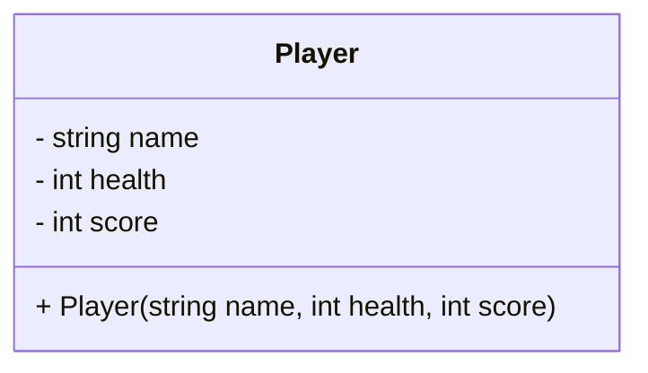
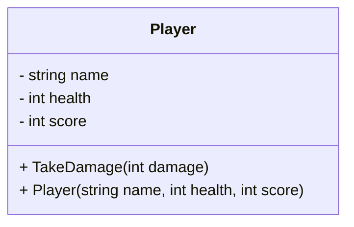
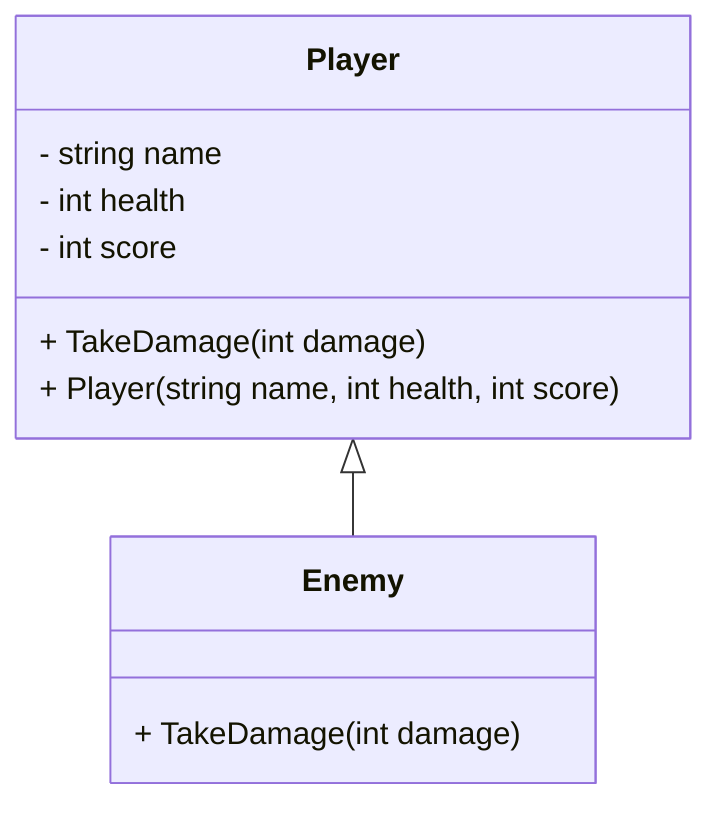
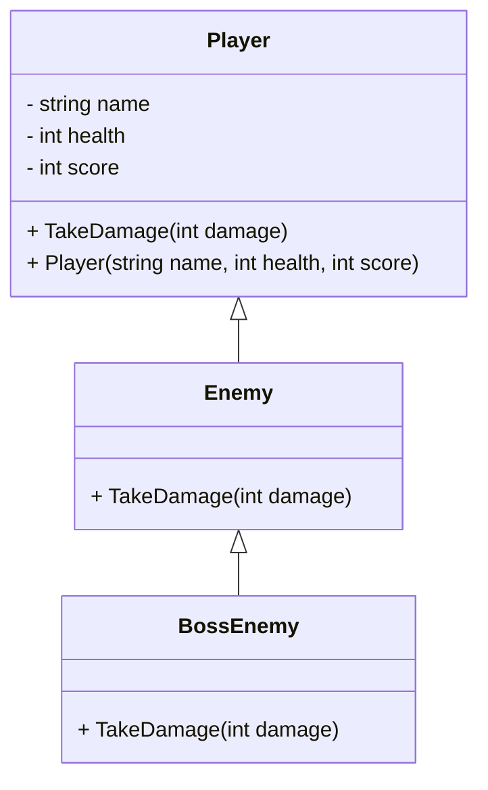
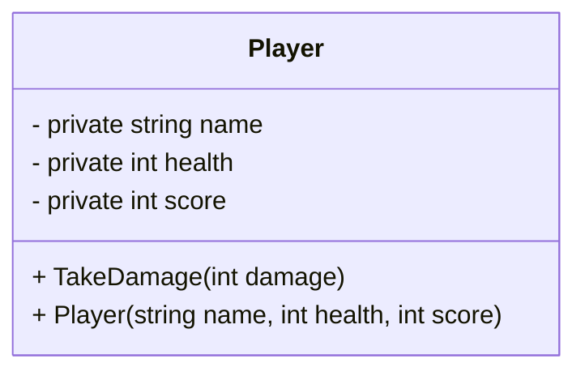
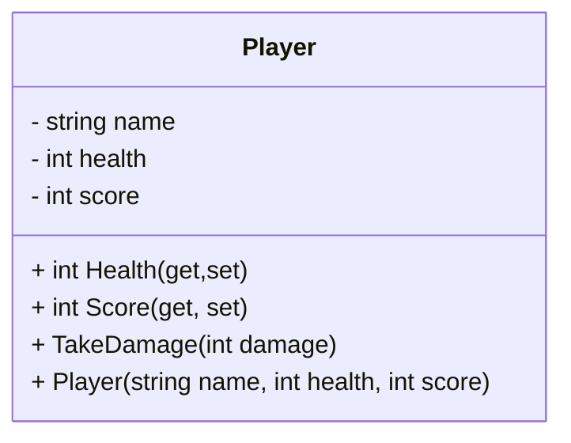
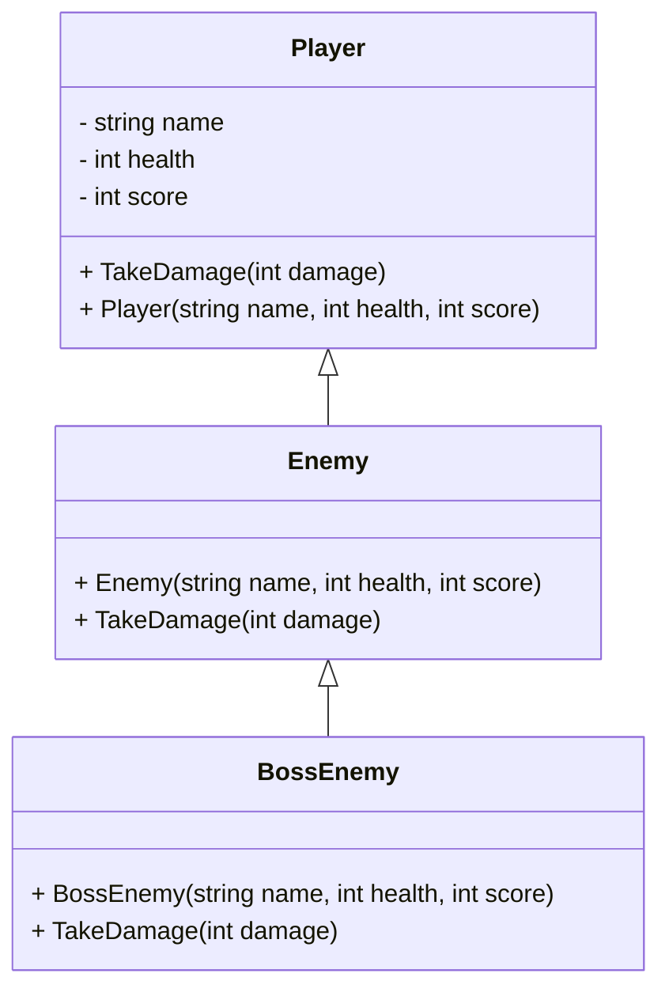

# 2024 - 25 - GD - C# - Intro 

# Content

| **Topic**                                     | **Content**                                                                                                                                   | **Time (hours)** |
|:-----------------------------------------------|:-----------------------------------------------------------------------------------------------------------------------------------------------|:------------------|
| **1. Introduction to C#**                     | Basic syntax & structure (variables, data types, loops, conditionals)                                                                        | 1.5              |
|                                               | Differences between C# and Java/C++                                                                                                         |                  |
|                                               | Understanding namespaces and common Unity namespaces (e.g., `using UnityEngine`)                                                            |                  |
| **2. Object-Oriented Programming in C#**      | Classes, objects, properties vs. fields, and methods                                                                                         | 2              |
|                                               | Inheritance and polymorphism in C#                                                                                                          |                  |
|                                               | Access modifiers (`public`, `private`, `protected`)                                                                                          |                  |
|                                               | Constructors and destructors (including garbage collection)                                                                                  |                  |
| **3. C# and Unity Scripting Basics**          | Unity's component-based architecture                                                                                                         | 1.5              |
|                                               | Introduction to `MonoBehaviour`, `Start()`, `Update()`, and Unity's event functions                                                          |                  |
|                                               | Writing a simple script to manipulate GameObjects                                                                                            |                  |
| **4. C# Advanced Features Used in Unity**     | Delegates and events (introduction and use in Unity)                                                                                          | 2              |
|                                               | Coroutines (`IEnumerator`) and asynchronous tasks (e.g., object movement, timers)                                                            |                  |
|                                               | Properties in C# and how they relate to Unity's Inspector                                                                                    |                  |
| **5. Unity’s Common C# Data Structures**      | Arrays and Lists                                                                                                                             | 1              |
|                                               | Dictionaries and key-value mapping                                                                                                           |                  |
|                                               | Enumerations (Enums) for game state management                                                                                               |                  |
| **6. Error Handling & Debugging**             | Exception handling with `try-catch` blocks                                                                                                   | 0.5              |
|                                               | Using `Debug.Log` for debugging in Unity                                                                                                     |                  |
|                                               | Introduction to debugging in Visual Studio (breakpoints, variable inspection)                                                                |                  |

# Exercises

## Topics 1 & 2

### Exercise 1: Basic Syntax & Variables
**Description**: Write a C# script that declares variables of different data types (`int`, `float`, `string`, `bool`). Assign values to these variables and print them using `Debug.Log`.  
**Difficulty**: Easy

---

### Exercise 2: Conditional Statements
**Description**: Write a script that takes an `int` variable for a player's score. If the score is above 50, print "You win!", otherwise print "Try again!".  
**Difficulty**: Easy

---

### Exercise 3: Loops and Arrays
**Description**: Create a C# script that declares an array of 5 integers. Use a `for` loop to iterate through the array, printing each element to the console.  
**Difficulty**: Easy

---

### Exercise 4: Functions & Parameters
**Description**: Write a function in C# that takes two integers as parameters, adds them together, and returns the sum. Call the function in `Start()` and print the result using `Debug.Log`.  
**Difficulty**: Easy

---

### Exercise 5: Creating a Simple Class
**Description**: Create a class called `Player` with fields for `name` (string), `health` (int), and `score` (int). In the `Start()` method of a script, create an instance of `Player`, set its values, and print them using `Debug.Log`.  
**Difficulty**: Medium

---

### Exercise 6: Class Methods
**Description**: Expand the `Player` class by adding a method `TakeDamage(int damage)` that decreases the `health` of the player by the amount of damage taken. Test the method by calling it in the `Start()` method and printing the player’s new health.  
**Difficulty**: Medium

---

### Exercise 7: Constructors
**Description**: Modify the `Player` class by adding a constructor that takes `name`, `health`, and `score` as parameters to initialize the fields. Create an instance of `Player` using this constructor in the `Start()` method.  
**Difficulty**: Medium

---

### Exercise 8: Inheritance & Overriding
**Description**: Create a class `Enemy` that inherits from the `Player` class. Override the `TakeDamage()` method in `Enemy` to make the enemy lose double the damage amount. Create an instance of `Enemy` in `Start()` and test the method.  
**Difficulty**: Medium

---

### Exercise 9: Polymorphism
**Description**: Create another class `BossEnemy` that inherits from `Enemy`. Implement polymorphism by overriding the `TakeDamage()` method in `BossEnemy` to lose only half the damage. Create instances of `Enemy` and `BossEnemy`, and test them to see how damage is handled differently.  
**Difficulty**: Medium-Hard

---

### Exercise 10: Access Modifiers
**Description**: Modify the `Player` class to use appropriate access modifiers (`private`, `protected`, `public`) for fields and methods. Test the access restrictions by trying to directly access `health` from outside the class.  
**Difficulty**: Medium-Hard

---

### Exercise 11: Properties (Getters & Setters)
**Description**: Refactor the `Player` class to use C# properties (`get` and `set`) for `health` and `score`. Add validation in the setter of `health` to ensure it cannot go below zero. Test the property by trying to set `health` to a negative value.  
**Difficulty**: Hard

---

### Exercise 12: Inheritance with Constructor Chaining
**Description**: Modify the `Enemy` and `BossEnemy` classes to use constructor chaining when initializing `Player`'s fields (e.g., passing values to the base `Player` constructor). Create instances of both `Enemy` and `BossEnemy` with specific health values and verify that the constructor chain works properly.  
**Difficulty**: Hard

