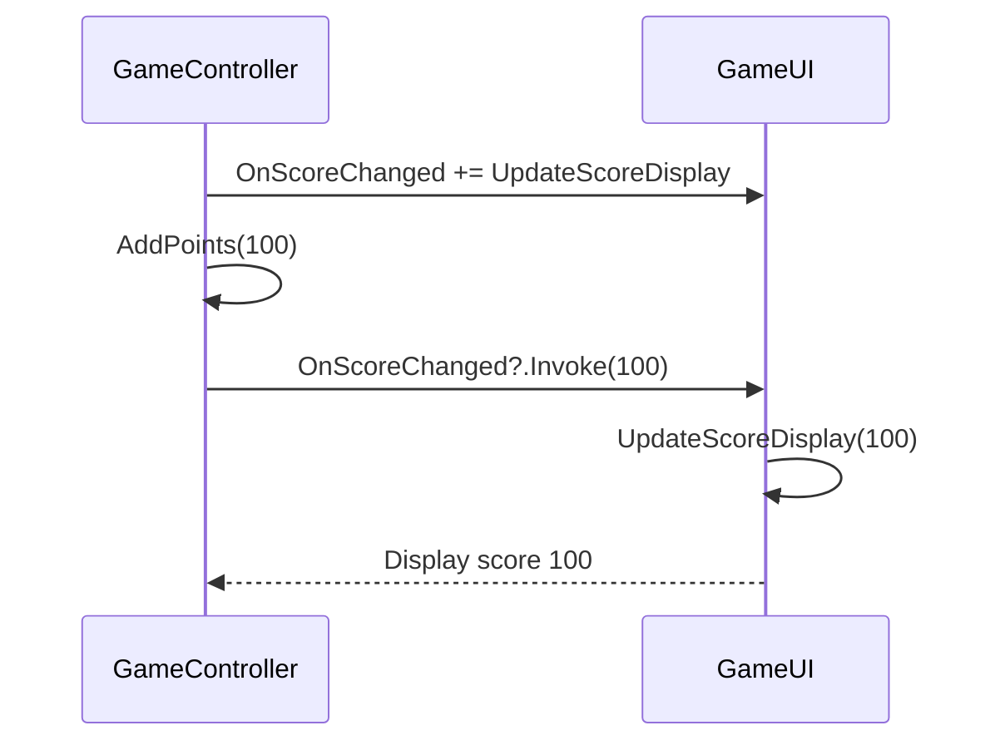
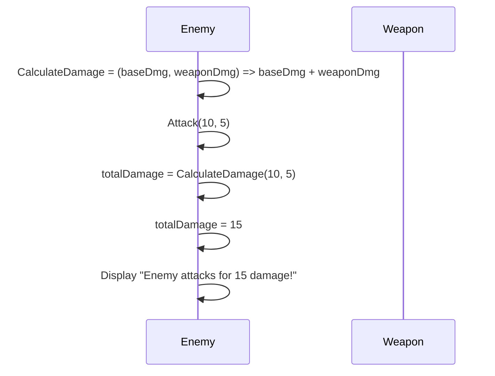
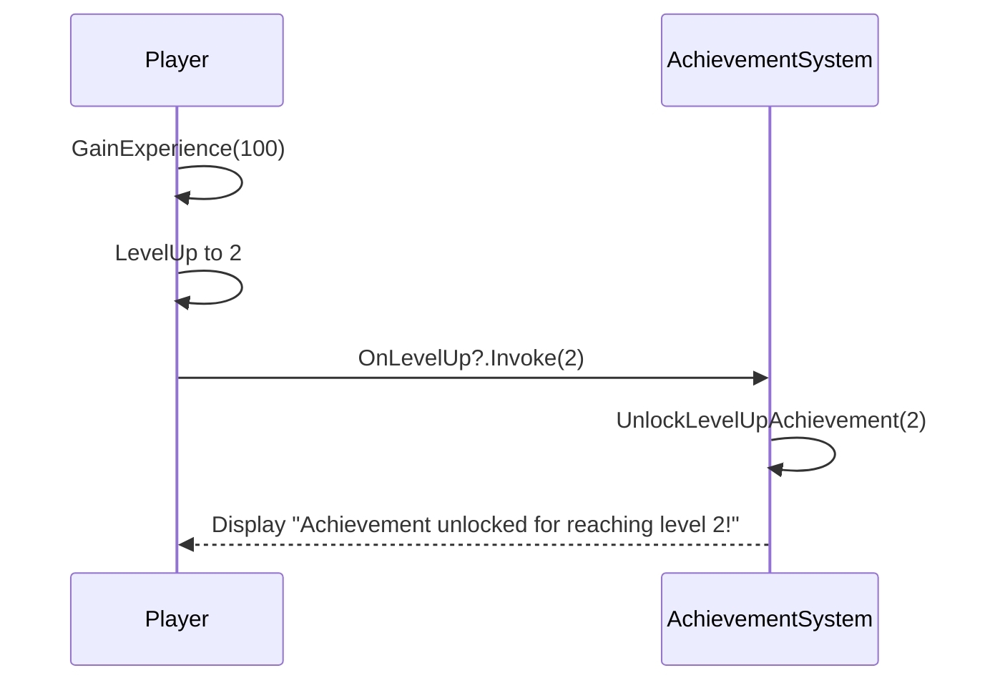
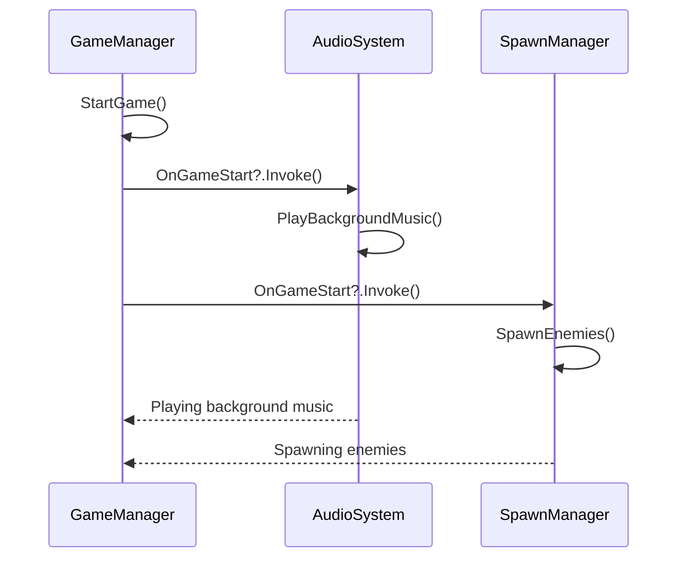

# C# Function Types in Unity Game Development

Understanding different function types in C# is crucial for writing flexible and maintainable code in Unity game development. This guide covers **Action**, **Func**, **Delegate**, and **Event** types, explaining what they are, how they work, and how to use them effectively in your games.

---

## Introduction to Delegates

Before diving into specific types, it's important to understand what **delegates** are in C#.

- **Delegates** are type-safe references to methods. They allow methods to be passed as parameters, stored as variables, and invoked dynamically.
- Think of delegates as pointers or references to functions, but with type safety and security provided by the C# language.

---

## 1. **Action**

### What is an Action?

- An **Action** is a built-in delegate type in C# that represents a method that **does not return a value** (`void`).
- It can take **zero or more input parameters**.
- Syntax: `Action<T1, T2, ...>` where `T1`, `T2`, etc., are the types of input parameters.

### Why Use Action?

- **Simplifies Code**: Instead of declaring custom delegate types for methods that return void, you can use `Action`.
- **Enhances Readability**: Makes it clear that the method performs an action without returning a result.
- **Facilitates Callbacks**: Useful for methods that need to execute after certain operations.

### Example

```csharp
using System;

public class GameUI
{
    public void UpdateScoreDisplay(int score)
    {
        Console.WriteLine($"Score: {score}");
    }
}

public class GameController
{
    public Action<int> OnScoreChanged;

    private int score;

    public void AddPoints(int points)
    {
        score += points;
        OnScoreChanged?.Invoke(score);
    }
}

// Usage
GameUI ui = new GameUI();
GameController controller = new GameController();

controller.OnScoreChanged = ui.UpdateScoreDisplay;
controller.AddPoints(100); // Output: Score: 100
```

### Sequence Diagram: Action (Score Update Example)



### Use in Game Development

- **UI Updates**: Trigger UI changes when game data changes, like updating the score or health display.
- **Simple Callbacks**: Execute code after an operation completes without needing a return value.

---

## 2. **Func**

### What is a Func?

- **Func** is a built-in delegate type that represents a method that **returns a value**.
- It can take **zero or more input parameters**.
- The **last type parameter** specifies the return type.
- Syntax: `Func<T1, T2, ..., TResult>` where `TResult` is the return type.

### Why Use Func?

- **Simplifies Delegate Creation**: Eliminates the need to declare custom delegates for methods that return a value.
- **Flexible Computations**: Allows passing methods that perform calculations or return data.
- **Integration with LINQ**: Commonly used with LINQ for selecting, filtering, and projecting data.

### Example

```csharp
using System;

public class Enemy
{
    public Func<int, int, int> CalculateDamage;

    public void Attack(int baseDamage, int weaponDamage)
    {
        int totalDamage = CalculateDamage?.Invoke(baseDamage, weaponDamage) ?? 0;
        Console.WriteLine($"Enemy attacks for {totalDamage} damage!");
    }
}

// Usage
Enemy enemy = new Enemy();
enemy.CalculateDamage = (baseDmg, weaponDmg) => baseDmg + weaponDmg;
enemy.Attack(10, 5); // Output: Enemy attacks for 15 damage!
```

### Sequence Diagram: Func (Damage Calculation Example)



### Use in Game Development

- **AI Decisions**: Determine the next move or action for AI characters based on game state.
- **Game Mechanics Calculations**: Perform computations like damage calculations, score evaluations, or physics computations.

---

## 3. **Delegate**

### What is a Delegate?

- A **delegate** is a type that represents references to methods with a specific parameter list and return type.
- Think of a delegate as a **type-safe function pointer**.
- Allows methods to be passed as parameters or assigned to variables.
- Custom delegates can be defined when built-in delegates (`Action` or `Func`) don't meet your needs.

### Why Use Delegates?

- **Custom Signatures**: When you need a method signature that isn't covered by `Action` or `Func` (e.g., methods with `ref` or `out` parameters).
- **Event Systems**: Serve as the foundation for events, enabling a publish-subscribe mechanism.
- **Encapsulation**: Hide method implementation details while exposing functionality.

### Example

```csharp
public delegate void LevelUpHandler(int newLevel);

public class Player
{
    public LevelUpHandler OnLevelUp;

    private int level = 1;

    public void GainExperience(int xp)
    {
        // Logic to increase level
        level++;
        OnLevelUp?.Invoke(level);
    }
}

public class AchievementSystem
{
    public void UnlockLevelUpAchievement(int level)
    {
        Console.WriteLine($"Achievement unlocked for reaching level {level}!");
    }
}

// Usage
Player player = new Player();
AchievementSystem achievements = new AchievementSystem();

player.OnLevelUp = achievements.UnlockLevelUpAchievement;
player.GainExperience(100); // Output: Achievement unlocked for reaching level 2!
```

### Sequence Diagram: Delegate (Level Up Example)



---

## 4. **Event**

### What is an Event?

- An **event** is a **wrapper around a delegate** that provides a way to **broadcast notifications**.
- Events enforce **encapsulation**, allowing only the class that declares the event to invoke it.
- Other classes can **subscribe** (`+=`) or **unsubscribe** (`-=`) from the event but cannot invoke it.

### Why Use Events?

- **Loose Coupling**: Decouple the sender of an event from its receivers, enhancing modularity.
- **Controlled Invocation**: Prevent external classes from invoking events, maintaining control over when they are triggered.
- **Multicast Delegates**: Allow multiple methods to be called when an event is raised.

### Example

```csharp
using System;

public class GameManager
{
    public event Action OnGameStart;

    public void StartGame()
    {
        Console.WriteLine("Game is starting...");
        OnGameStart?.Invoke();
    }
}

public class AudioSystem
{
    public void PlayBackgroundMusic()
    {
        Console.WriteLine("Playing background music.");
    }
}

public class SpawnManager
{
    public void SpawnEnemies()
    {
        Console.WriteLine("Spawning enemies.");
    }
}

// Usage
GameManager gameManager = new GameManager();
AudioSystem audioSystem = new AudioSystem();
SpawnManager spawnManager = new SpawnManager();

gameManager.OnGameStart += audioSystem.PlayBackgroundMusic;
gameManager.OnGameStart += spawnManager.SpawnEnemies;

gameManager.StartGame();
// Output:
// Game is starting...
// Playing background music.
// Spawning enemies.
```

### Sequence Diagram: Event (Game Start Example)



---

By incorporating these sequence diagrams, the examples become more visually intuitive, making it easier to understand how each C# function type operates within Unity's game development environment.
