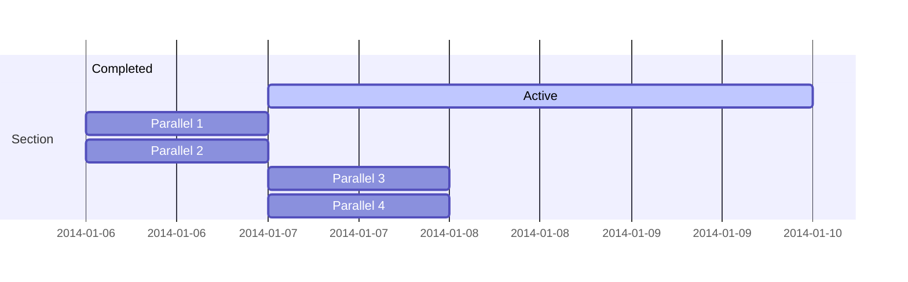

## To Do - Content Created In-Class

### Week 1
- [ ] Add `namespace`, static demos
- [ ] Use `ref` in a function call (see Program)
- [ ] Add demo class(es) (see Vector3, Player, PlayerList)
- [ ] Add `constructor chaining` (see Vector3)
- [ ] Add `properties` (set/get) (see Vector3)
- [ ] Add `string interpolation` demo (see Program, Vector3::ToString)
- [ ] Add `validation` on set properties (see Vector3::X with ternary)
- [ ] Add `intellisense regions` to organise our code (see Vector3)

